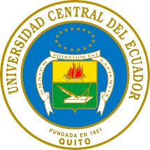

  <h1>Seminario-Taller: Buenas Prácticas en la Investigación Cuantitativa</h1>
  <h1>Universidad Central del Ecuador</h1>
    
  <h2>Vicerrectorado Académico y de Posgrado</h2>
  <h2>Dirección de Desarrollo Académico</h2>

 

---

## Datos Informativos

**Nombre del evento:** Seminario - Taller: Buenas prácticas en la Investigación Cuantitativa  
**Unidad Proponente:** Dirección de Desarrollo Académico  
**Responsable del evento:** MSc. Víctor Sánchez Raza  
**Beneficiarios:** Docentes y técnicos docentes de la Institución  
**Fechas:** Del 8 al 11 de septiembre 2025

---

## Descripción del Evento

La investigación cuantitativa es fundamental para la generación de conocimiento científico y la toma de decisiones basadas en datos. Este seminario tiene como objetivo capacitar a los participantes en las mejores prácticas y herramientas de la investigación cuantitativa, con un enfoque en técnicas estadísticas, validación de instrumentos y modelación asistida por inteligencia artificial.

---

## Objetivos del Seminario

### **Objetivo General**
- Analizar los elementos y relaciones causales de variables sociales y naturales utilizando técnicas probabilísticas e inteligencia artificial.

### **Objetivos Específicos**
1. Conocer los instrumentos de recolección de datos como encuestas y cuestionarios, y cómo garantizar su validez y confiabilidad.
2. Describir las metodologías de muestreo probabilístico y no probabilístico.
3. Incorporar técnicas de modelación asistida por inteligencia artificial para optimizar el diseño y selección de muestras.

---

## Contenido Académico

### **Horario de Expositores y Temas**

| **Día**         | **Hora**            | **Tema**                                                                             | **Facilitador**                                           | **Modalidad** |
|-----------------|---------------------|--------------------------------------------------------------------------------------|-----------------------------------------------------------|---------------|
| **8 de septiembre** | 11h30 a 13h30       | Epistemología de la Investigación Cuantitativa                                   | Dr. Carlos Mayorga, Facultad de Ciencias Químicas         | Presencial    |
| **9 de septiembre** | 08h30 a 13h30       | Tipos de Investigación Cuantitativa                                              | Dr. Carlos Mayorga, Facultad de Ciencias Químicas         | Presencial    |
| **9 de septiembre** | -                   | Población y Muestra                                                              | Dr. Jorge Arroba Rimassa, Facultad de Ciencias Aplicadas  | Presencial    |
| **9 de septiembre** | -                   | Diseño de Instrumento                                                            | Dr. Roberto Ortiz, Facultad de Ciencias Económicas        | Presencial    |
| **10 de septiembre**| 08h30 a 13h30       | Diseño de Instrumento (Cuestionario)                                             | Dr. Roberto Ortiz, Facultad de Ciencias Económicas        | Virtual       |
| **10 de septiembre**| 10h30 a 13h30       | Introducción a Python                                                            | Ing. Jonathan Sánchez, Centro de Física                   | Virtual       |
| **11 de septiembre**| 19h00 a 21h00       | Enfoques educativos y pedagógicos en el Bicentenario de la Fundación Republicana | MSc. Edgar Isch, Director General Académico               | Virtual       |

---

## **Recursos Utilizados**

| Tema                                                | Subtema                                        | Horas             | 
|-----------------------------------------------------|------------------------------------------------|-------------------|
| **Epistemología de la Investigación Cuantitativa**  | _Introducción a la Epistemología_              | 11h30 a 12h00     |        
|                                                     | _Confiabilidad y validez_                      | 12h00 a 12h20     |              
|                                                     | _Identificación de variables_                  | 12h20 a 12h45     |              
|                                                     | _Alcances_                                     | 12h45 a 13:30     |                         
| **Tipos de Investigación Cuantitativa**             | _Investigación Experimental_                   | 08h30 a 09h30     |          
|                                                     | _Investigación Cuasi-experimental_             | 09h30 a 10h30     |              
|                                                     | _Investigación No Experimental_                | 10h30 a 12h20     |              
|                                                     | _Ejemplos prácticos (PCA, ANOVA, Tukey)_       | 12h20 a 13h30     |           

* [Jupyter Notebook - Día 1](https://github.com/Zexc4/Seminario-Taller-Buenas-practicas-en-la-Investigacion-Cuantitativa/blob/main/Jupyter%20Notebook/Dia_1_Fundamentos_Cuantitativos_Epistemol%C3%B3gicos_%20Validaci%C3%B3n_Experimental_%20Ciencia_%20Ingenier%C3%ADa.ipynb)
* [Jupyter Notebook - Día 2](https://github.com/Zexc4/Seminario-Taller-Buenas-practicas-en-la-Investigacion-Cuantitativa/blob/main/Jupyter%20Notebook/Dia_2_Herramienta_%20Cuantitativas_Exploratorias_An%C3%A1lisis_Modelado_Ciencia_Ingenier%C3%ADa.ipynb)
* [Scripts de los Ejemplos](https://github.com/Zexc4/Seminario-Taller-Buenas-practicas-en-la-Investigacion-Cuantitativa/tree/main/Scripts)
* [Cuaderno de Ejercicios - Día 1](https://github.com/Zexc4/Seminario-Taller-Buenas-practicas-en-la-Investigacion-Cuantitativa/blob/main/Scripts%20Ejercicios/Dia_1_Ejercicios_de_Evaluaci%C3%B3n.ipynb)
* [Cuaderno de Ejercicios - Día 2](https://github.com/Zexc4/Seminario-Taller-Buenas-practicas-en-la-Investigacion-Cuantitativa/blob/main/Scripts%20Ejercicios/Dia_2_Ejercicios_de_Evaluaci%C3%B3n.ipynb)
* [Dataset para PCA](https://statisticsglobe.com/wp-content/uploads/2023/09/data_pca_200x16.csv)
* [Datasets Malware Detection](https://www.kaggle.com/datasets/nsaravana/malware-detection)
* [Tesis - Mayorga Carlos (2024) ](https://www.amarun.org/images/amarun/materiales/tesis-doctorales/2024_Mayorga_Carlos.pdf)                                                                     
---

## Referencias

1. Hernández Sampieri, R., Fernández Collado, C., & Baptista Lucio, P. (2014). *Metodología de la investigación* (6.ª ed.). McGraw-Hill.
2. Creswell, J. W. (2014). *Research design: Qualitative, quantitative, and mixed methods approaches* (4th ed.). SAGE Publications.
3. Montgomery, D. C. (2017). *Design and analysis of experiments* (9th ed.). John Wiley & Sons.
4. Jolliffe, I. T., & Cadima, J. (2016). Principal component analysis: A review and recent developments. *Philosophical Transactions of the Royal Society A: Mathematical, Physical and Engineering Sciences*, *374*(2065), 20150202. https://doi.org/10.1098/rsta.2015.0202
5. Field, A. (2013). *Discovering statistics using IBM SPSS Statistics* (4th ed.). SAGE Publications.
6. Schork, J. (2020). Datasets for PCA (Free CSV Download) | Synthetic & Real Data. Statistics Globe. Recuperado de https://statisticsglobe.com/datasets-for-pca
7. Tukey, J. W. (1977). *Exploratory data analysis*. Addison-Wesley.
8. Zavala, R. J. (2019). Fundamentos epistémicos de la investigación cualitativa y cuantitativa. *Revista Científica de Ciencias de la Salud*, *22*(1), 75–80. [https://www.scielo.org.pe/scielo.php?script=sci_arttext&pid=S2223-25162019000100008](https://www.scielo.org.pe/scielo.php?script=sci_arttext&pid=S2223-25162019000100008)
9. Bharadwaj, S. S., & Sreenivasan, K. R. (2025). Compact quantum algorithms for time-dependent differential equations. Physical Review Research, 7, 023262. https://doi.org/10.1103/PhysRevResearch.7.023262
10. Alvarez-Rodriguez, U., Sanz, M., Lamata, L., & Solano, E. (2017). Advanced-Retarded Differential Equations in Quantum Photonic Systems. Scientific Reports, 7, 42933. https://doi.org/10.1038/srep42933
11. Paudel, H. P., Syamlal, M., Crawford, S. E., Lee, Y.-L., Shugayev, R. A., Lu, P., Ohodnicki, P. R., & Mollot, D. (2022). Quantum Computing and Simulations for Energy Applications: Review and Perspective. ACS Engineering Au, 2(3), 151–196. https://doi.org/10.1021/acsengineeringau.1c00033
12. Tong, Y. (2025). Qubit-Efficient Quantum Algorithm for Linear Differential Equations. arXiv preprint arXiv:2507.16995.
13. Nithya, D., Madhusudanan, V., Murthy, B. S. N., Geetha, R., Mung, N. X., Dao, N.-N., & Cho, S. (2024). Delayed dynamics analysis of SEI2RS malware propagation models in cyber–physical systems. Computer Networks, 248, 110481. https://doi.org/10.1016/j.comnet.2024.110481
14. Zhang, W., Yang, X., & Yang, L. (2025). A Delayed Malware Propagation Model Under a Distributed Patching Mechanism: Stability Analysis. Mathematics, 13(14), 2266. https://doi.org/10.3390/math13142266
15. Hill, D. R. C., Antunes, B. A., Cluzel, T., & Mazel, C. (2023). A few words about quantum computing, epistemology, repeatability and reproducibility. HAL Open Science, hal-04089148v1.
16. Arute, F., Arya, K., Babbush, R., Bacon, D., Bardin, J. C., Barends, R., Biswas, R., Boixo, S., Brandao, F. G. S. L., Buell, D. A., Burkett, B., Chen, Y., Chen, Z., Chiaro, B., Collins, R., Courtney, W., Dunsworth, A., Farhi, E., Foxen, B., … Martinis, J. M. (2019). Quantum supremacy using a programmable superconducting processor. Nature, 574(7779), 505–510. https://doi.org/10.1038/s41586-019-1666-5

---

## Contacto

**Dr. Carlos Julio Mayorga Arias**  
Facultad de Ciencias Químicas, Universidad Central del Ecuador  

 

    
    
    

---

## Licencia

Este seminario-taller está organizado por la **Universidad Central del Ecuador** y se encuentra bajo la [**Licencia Creative Commons Atribución-No Comercial-Sin Derivadas 4.0 Internacional**](https://creativecommons.org/licenses/by-nc-nd/4.0/).

Esto significa que:
- **Pueden compartir** el contenido **solo de manera no comercial**.
- **No se puede modificar** ni realizar obras derivadas basadas en el contenido original.
- **Siempre se debe atribuir** adecuadamente a los autores y la institución correspondiente.

El uso comercial o la modificación del material están estrictamente prohibidos, y la obra debe ser **reproducida tal cual** como se proporciona.

Para más detalles, consulta la licencia completa en [Creative Commons](https://creativecommons.org/licenses/by-nc-nd/4.0/).

 

    

